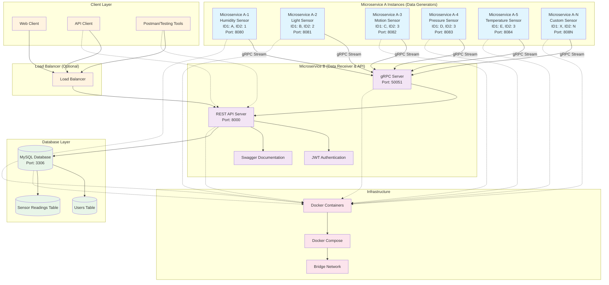
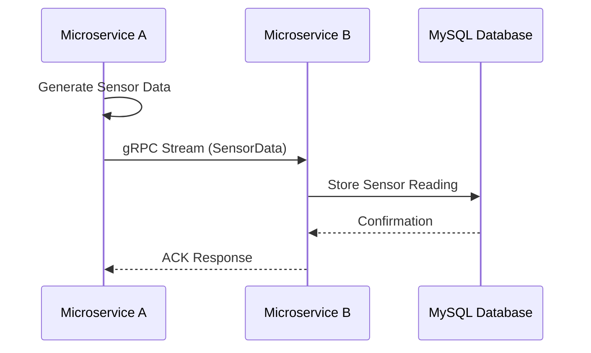
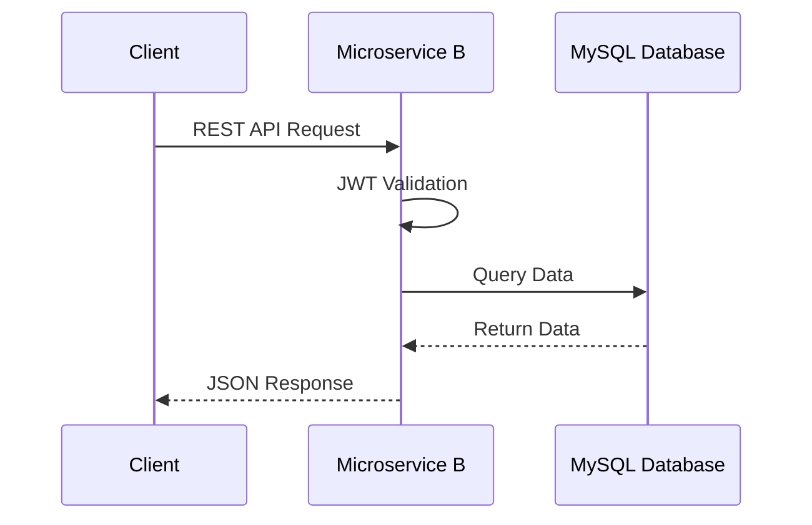

# Sensor Microservices Architecture

## System Overview

This document describes the architecture of the sensor microservices system, which consists of multiple data generators (Microservice A instances) communicating with a centralized data receiver and API service (Microservice B).

## Architecture Diagram

## Data Flow

### 1. Data Generation Flow

### 2. API Request Flow

## Component Details

### Microservice A (Data Generators)
- **Purpose**: Generate sensor data streams
- **Technology**: Go, Echo Framework, gRPC Client
- **Features**:
    - Configurable sensor types (Temperature, Humidity, Pressure,Light,Motion etc.)
    - Adjustable data generation frequency via REST API
    - gRPC streaming to Microservice B
    - Swagger documentation

### Microservice B (Data Receiver & API)
- **Purpose**: Receive, store, and serve sensor data
- **Technology**: Go, Echo Framework, gRPC Server, MySQL
- **Features**:
    - gRPC server for receiving sensor data
    - REST API for data retrieval and manipulation
    - JWT-based authentication and authorization
    - Database operations with filtering and pagination
    - Swagger documentation

### Database Schema
- **Users Table**: User authentication and authorization
- **Sensor Readings Table**: Time-series sensor data storage
- **Indexes**: Optimized for queries by ID combinations and time ranges

### Infrastructure
- **Docker**: Containerization for all services
- **Docker Compose**: Orchestration and networking
- **MySQL**: Persistent data storage
- **Bridge Network**: Inter-service communication

## Scalability Features

1. **Horizontal Scaling**: Multiple Microservice A instances
2. **Load Distribution**: Each instance handles different sensor types
3. **Database Optimization**: Indexed queries for performance
4. **Container Orchestration**: Easy deployment and scaling
5. **Network Isolation**: Secure inter-service communication

## Security Features

1. **JWT Authentication**: Secure API access
2. **Role-based Authorization**: Admin and Analyst roles
3. **Network Isolation**: Docker bridge network
4. **Input Validation**: API payload validation
5. **Secure Communication**: gRPC and HTTPS support
