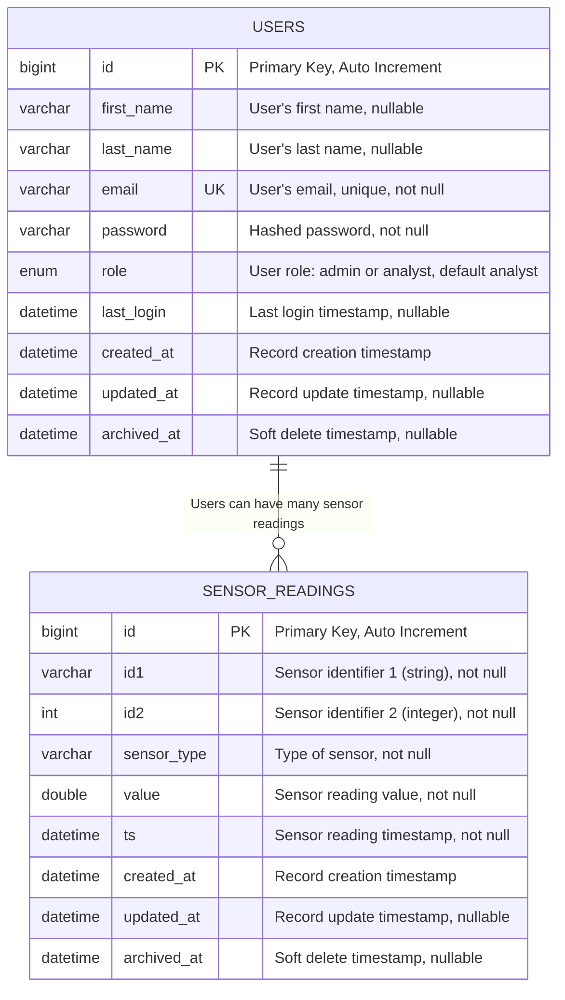
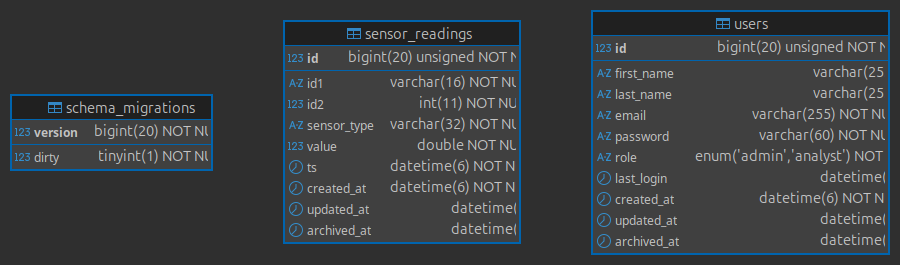

# Database Schema & Entity Relationship Diagram

## Entity Relationship Diagram (ERD)



## Database Schema Details

### Users Table
```sql
CREATE TABLE users (
    id BIGINT UNSIGNED AUTO_INCREMENT PRIMARY KEY,
    first_name VARCHAR(255) NULL DEFAULT NULL,
    last_name VARCHAR(255) NULL DEFAULT NULL,
    email VARCHAR(255) NOT NULL UNIQUE,
    password VARCHAR(60) NOT NULL,
    role ENUM('admin','analyst') NOT NULL DEFAULT 'analyst',
    last_login DATETIME(6) NULL DEFAULT NULL,
    created_at DATETIME(6) NOT NULL DEFAULT CURRENT_TIMESTAMP(6),
    updated_at DATETIME(6) NULL DEFAULT NULL ON UPDATE CURRENT_TIMESTAMP(6),
    archived_at DATETIME(6) NULL DEFAULT NULL
) ENGINE=InnoDB DEFAULT CHARSET=utf8mb4;
```

### Sensor Readings Table
```sql
CREATE TABLE sensor_readings (
    id BIGINT UNSIGNED AUTO_INCREMENT PRIMARY KEY,
    id1 VARCHAR(16) NOT NULL,
    id2 INT NOT NULL,
    sensor_type VARCHAR(32) NOT NULL,
    value DOUBLE NOT NULL,
    ts DATETIME(6) NOT NULL,
    created_at DATETIME(6) NOT NULL DEFAULT CURRENT_TIMESTAMP(6),
    updated_at DATETIME(6) NULL DEFAULT NULL ON UPDATE CURRENT_TIMESTAMP(6),
    archived_at DATETIME(6) NULL DEFAULT NULL,
    INDEX IX_id_combo (id1, id2),
    INDEX IX_type_ts (sensor_type, ts),
    INDEX IX_combo_ts (id1, id2, ts),
    INDEX IX_ts (ts)
) ENGINE=InnoDB DEFAULT CHARSET=utf8mb4;
```

## Index Strategy

### Primary Indexes
- **users.id**: Primary key for user identification
- **sensor_readings.id**: Primary key for sensor reading identification

### Composite Indexes
- **IX_id_combo (id1, id2)**: Optimizes queries filtering by sensor ID combination
- **IX_type_ts (sensor_type, ts)**: Optimizes queries filtering by sensor type and time range
- **IX_combo_ts (id1, id2, ts)**: Optimizes complex queries with ID combination and time filtering
- **IX_ts (ts)**: Optimizes time-range queries

### Unique Constraints
- **users.email**: Ensures email uniqueness for user authentication

## Data Types and Constraints

### Users Table
- **id**: Auto-incrementing primary key
- **first_name**: User's first name, nullable
- **last_name**: User's last name, nullable
- **email**: Unique constraint for authentication
- **password**: Hashed using bcrypt (60 characters)
- **role**: Enum with 'admin' and 'analyst' values
- **Timestamps**: All tables include created_at, updated_at, and archived_at for audit trail

### Sensor Readings Table
- **id1**: String identifier (e.g., "A", "B", "C")
- **id2**: Integer identifier (e.g., 1, 2, 3)
- **sensor_type**: Type of sensor (e.g., "Temperature", "Humidity", "Pressure")
- **value**: Double precision floating point for sensor readings
- **ts**: Precise timestamp for sensor reading time

## Query Patterns Supported

### 1. Filter by ID Combination
```sql
SELECT * FROM sensor_readings 
WHERE id1 = 'A' AND id2 = 1;
```

### 2. Filter by Time Range
```sql
SELECT * FROM sensor_readings 
WHERE ts BETWEEN '2025-01-01 00:00:00' AND '2025-01-31 23:59:59';
```

### 3. Filter by Sensor Type
```sql
SELECT * FROM sensor_readings 
WHERE sensor_type = 'Temperature';
```

### 4. Complex Filtering with Pagination
```sql
SELECT * FROM sensor_readings 
WHERE id1 = 'A' 
  AND ts BETWEEN '2025-01-01' AND '2025-01-31'
ORDER BY ts DESC 
LIMIT 10 OFFSET 0;
```

### 5. Aggregation Queries
```sql
SELECT sensor_type, COUNT(*), AVG(value), MIN(value), MAX(value)
FROM sensor_readings 
WHERE ts >= DATE_SUB(NOW(), INTERVAL 1 HOUR)
GROUP BY sensor_type;
```

## Performance Considerations

### Index Usage
- All query patterns are optimized with appropriate indexes
- Composite indexes support multi-column filtering
- Time-based queries use timestamp indexes

### Data Volume Handling
- BigInt primary keys support large datasets
- Indexed columns enable fast lookups
- Soft delete pattern preserves data integrity
- Hard delete Permanently removes records from the database, freeing storage but losing historical data.

### Scalability
- Horizontal partitioning possible by sensor_type or time ranges
- Read replicas can be added for read-heavy workloads
- Connection pooling supported through Go's sqlx

## Migration History

### Migration 0001: Create Users Table
- Initial user authentication table
- Basic user management structure

### Migration 0002: Create Sensor Readings Table
- Core sensor data storage
- Optimized indexes for query patterns

### Migration 0003: Alter User Table
- Added first_name, last_name fields
- Modified password field length for bcrypt
- Added last_login tracking

